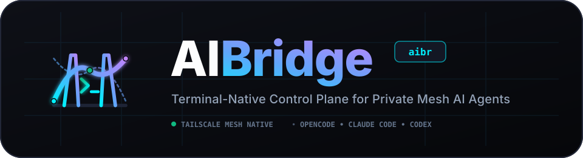

<h1>AIBridge</h1>

<p><strong>Tailscale mesh control plane for AI agents.</strong></p>

<p align="center">
  
</p>

<p align="center">
  <a href="Docs/assets/logos/logo-design-system.html"><code>╭─▲─╮ ◈ AIBridge</code></a>
</p>

[](https://github.com/nyugennguyen/AIBridge/actions/workflows/ci.yml)
[](LICENSE)
[](https://bun.sh)
[](https://www.rust-lang.org)

**AIBridge** is a resilient, polyglot orchestrator and agent mesh connecting OpenCode and local execution daemons securely across machines over private Tailscale networks.

AIBridge replaces traditional monolithic bridge architectures with a **two-tier polyglot architecture**: a native Rust ingress router (`aibr-router`) for low-overhead, fail-closed admission and durable queuing, paired with a TypeScript/Bun worker daemon (`aibr worker`) for semantic task execution, rule evaluation, and distributed orchestration.

The first supported topology is two machines:

- `dev-main`: development workstation that triggers remote work.
- `test-vps`: testing VPS that creates a fresh opencode session, runs the requested task, and reports back.

The bridge keeps the design ready for a future N-machine mesh through explicit registry, routing, job store, auth, plan review, and permission policy boundaries.

---

## Architecture Overview

```
                      Private Tailscale Network (100.64.0.0/10)
                                      │
                         HTTP/JSON POST /trigger
                                      ▼
             ┌─────────────────────────────────────────────────┐
             │       Tier 1: aibr-router (Native Rust)         │
             │─────────────────────────────────────────────────│
             │ • Binds tailscale0:8787 (4-layer preflight)    │
             │ • Constant-time Bearer authentication (subtle)  │
             │ • Bounded inflight concurrency (cap: 64)        │
             │ • Payload body limit (1 MiB ceiling)            │
             │ • Structural validation & envelope checks       │
             └───────────────────────┬─────────────────────────┘
                                     │ Commit before 202
                                     ▼
                      ┌──────────────────────────────┐
                      │    Durable SQLite Queue      │
                      │  (ingress_outbox, WAL mode)  │
                      └──────────────┬───────────────┘
                                     │ Drain via claim lease
                                     ▼
             ┌─────────────────────────────────────────────────┐
             │       Tier 2: aibr worker (Bun / TypeScript)     │
             │─────────────────────────────────────────────────│
             │ • Sole semantic authorization authority         │
             │ • Source authorization & project allowlists     │
             │ • Plan review & safety policy enforcement       │
             │ • Reusable workflows & deterministic rules      │
             │ • Multi-project memory & secret redaction       │
             │ • Durable egress callback outbox                │
             └───────────────────────┬─────────────────────────┘
                                     │ Loopback only (127.0.0.1:4096)
                                     ▼
             ┌─────────────────────────────────────────────────┐
             │            Local OpenCode Instance              │
             └─────────────────────────────────────────────────┘
```

### Core Design Invariants
1. **Two-Tier Validation:** The router is a structural gate, never an authorization authority. The worker independently re-parses and enforces all semantic permissions, allowlists, and approvals.
2. **Commit Before 202 (`SF-08`):** An admission response (`HTTP 202 Accepted`) is emitted **only** after the work has been durably committed to SQLite disk storage (`synchronous=FULL`). No in-memory queues or fallback drop-paths exist.
3. **Decoupled Interactive TUI:** The terminal interface (`aibr tui`) runs independently of running background agents and daemons. Disconnecting or closing the UI never disrupts active agent runs.
4. **Append-Only Immutability:** Authoritative event logs are immutable. Repair and maintenance tools never rewrite or delete history.
5. **Terminal Outbox Rows are Evidence:** Errored or failed outbox records are preserved as permanent audit evidence with error taxonomy codes and attempt counters. They are never purged to "clear a backlog."
6. **Automated Secret Redaction:** Prompts, transcripts, raw memory, bearer tokens, and private paths are scrubbed by default across all logs, telemetry, and diagnostics support bundles.

---

## Supported Platforms

AIBridge is tested on:

- **macOS** (Apple Silicon `aarch64` and Intel `x86_64`)
- **Debian / Ubuntu** Linux (`x86_64` and `aarch64`)

Other platforms are not supported. The `aibr setup` command will refuse to run on unsupported systems.

---

## Requirements

Before installing AIBridge, ensure every participating machine has:

| Requirement | Notes |
|---|---|
| [Bun](https://bun.sh) >= 1.3.0 | Install from the official installer at bun.sh. |
| [tmux](https://github.com/tmux/tmux) | Used for process supervision. `aibr setup` can install it via Homebrew (macOS) or apt (Debian/Ubuntu) with your confirmation. |
| [opencode](https://opencode.ai) | `aibr setup` can install it via `bun install -g opencode-ai` with your confirmation. Bound strictly to loopback `127.0.0.1`. |
| [Tailscale](https://tailscale.com) | Must be installed, logged in, and authenticated. The bridge binds to your Tailscale IPv4 address — it is never exposed to the public Internet. |

---

## Install

One-liner (macOS / Debian / Ubuntu, requires Tailscale):

```bash
curl -fsSL https://raw.githubusercontent.com/nyugennguyen/AIBridge/main/scripts/install.sh | bash
# non-interactive (CI):
curl -fsSL https://raw.githubusercontent.com/nyugennguyen/AIBridge/main/scripts/install.sh | bash -s -- --yes
```

The installer will:
1. Detect OS (macOS / Debian / Ubuntu) — refuses unsupported platforms.
2. Check `bun >=1.3.0` (prompts to install from bun.sh if missing), `tmux`, `opencode`, `tailscale`.
3. Prompt before any `brew`/`apt-get` install (bypass with `--yes`).
4. Run `bun install -g @nyugennguyen/aibridge` (or `@<version>` via `AIBRIDGE_VERSION`).
5. Verify `aibr --version` and that `$(bun pm bin -g)` is on `PATH`.
6. Warn if `tailscale status` is not `Running`.

Manual fallback:

```bash
bun install -g @nyugennguyen/aibridge
aibr --version
```

Verify the `aibr` command is on your PATH:

```bash
aibr --version
```

If `aibr` is not found, add the global Bun bin directory to your shell profile:

```bash
# Check where Bun installs globals
bun pm bin -g

# Add to your shell profile (e.g. ~/.bashrc, ~/.zshrc)
export PATH="$(bun pm bin -g):$PATH"
```

---

## Setup

### Run the setup wizard

AIBridge uses one shared bearer token to authenticate requests between hosts. The wizard can generate it for you in Step 2; you only need to copy the value across to your peer machine.

Run it on each machine:

```bash
aibr setup --profile <name>
```

For example, on your development workstation:

```bash
aibr setup --profile dev-main
```

And on your testing VPS:

```bash
aibr setup --profile test-vps
```

### The 5-step wizard

The full interactive mockup is in [`Docs/tui/aibridge-setup-wizard.html`](Docs/tui/aibridge-setup-wizard.html), and the brand tokens are in [`Docs/assets/logos/logo-design-system.html`](Docs/assets/logos/logo-design-system.html).

The wizard walks five steps. You can jump straight to any step you have already completed by typing its number (`1`–`5`).

| Step | What it does |
| --- | --- |
| **1. Network** | Verifies Tailscale is running, extracts this machine's Tailscale IPv4 and MagicDNS hostname, and checks that ports `4095` (router), `4096` (OpenCode), and `8787` (bridge) are free. |
| **2. Security** | Generates a CSPRNG bearer token, or accepts one you paste. Press `r` to regenerate. Confirms the security floor: constant-time token comparison, a 2 MB body cap, and automatic secret redaction. |
| **3. Allowlists** | Choose the project roots agents may touch. Containment is enforced **fail-closed**: a path that is not under an allowed root is refused, not clamped. |
| **4. AI Runtimes** | Probes the OpenCode loopback endpoint and resolves the `claude` and `codex` CLIs on `$PATH`. Sets peer agent ID and URL. |
| **5. Install & Test** | Writes a supervisor unit (launchd on macOS, systemd on Linux) and runs a preflight audit. |

**Controls.** `Tab` / `Shift+Tab` move between fields, `Space` toggles the focused checkbox, `Enter` submits and advances, `Esc` or `b` goes back, `r` regenerates the token in Step 2, and the mouse works throughout — step tabs, checkboxes, and buttons are all clickable.

If you would rather not generate a token, or you want a specific one shared across hosts, answer `n` at Step 2 and paste the same value on both machines:

```bash
openssl rand -hex 32
```

Save it in an approved secret channel, such as a password manager. Both machines must use the same token.

Do not put it in shell history or source control. The token is not stored in `config.json` — it is kept separately at `~/.local/share/aibridge/<profile>/secrets/bearer_token` with `0600` permissions, beneath your configured XDG data directory.

### What setup does and does not do

Setup writes the supervisor unit but **does not start it**. The unit is `KeepAlive`, so activating one whose config does not match the router's store turns a setup mistake into a restart loop. When setup finishes it asks whether to start the daemon now, and reports which of four states you are actually in:

- daemon started
- unit written but not started (prints the command to start it yourself)
- unit could not be written (error shown)
- no supervisor unit on this platform

This matters because a unit that was never started and a unit that is running look identical from the outside.

**Setup does not provision the ingress queue.** The `ingress_outbox` table belongs to the Rust router and is created by an explicit operator step, `aibr-router --init-store`. The wizard deliberately does not create it: an implicitly-created store is a queue that has lost every row it admitted, because the router refuses to serve against it and the worker drains an empty one.

### XDG Profile Locations

Profile data is stored in XDG-compliant directories:

| Data | Location |
| --- | --- |
| Config | `~/.config/aibridge/<profile>/config.json` |
| Secrets | `~/.local/share/aibridge/<profile>/secrets/` |
| State (jobs, tasks) | `~/.local/state/aibridge/<profile>/` |

Override with `XDG_CONFIG_HOME`, `XDG_DATA_HOME`, or `XDG_STATE_HOME` environment variables.

All directories are created with `0700` permissions (owner-only). Config and secret files use `0600` permissions. The setup wizard refuses to overwrite an existing profile without explicit confirmation.

---

## Start

Start the bridge and opencode on each machine:

```bash
aibr start --profile <name>
```

This creates a tmux session named `aibridge-<profile>` with two windows:

- **opencode** — runs `opencode serve --port 4096 --hostname 127.0.0.1` (loopback only)
- **aibridge** — runs the AIBridge daemon bound to your Tailscale IPv4 address

The OpenCode server is always bound to `127.0.0.1` — it is never accessible from the network. The bridge is bound to your Tailscale address — it is accessible only within your tailnet, never from the public Internet.

If the session already exists, `aibr start` reports it is already running without error.

### Attach to the session

```bash
tmux attach -t aibridge-<name>
```

Detach with `Ctrl+B, D`.

---

## Status

Check whether the bridge is healthy:

```bash
aibr status --profile <name>
```

This reports:

- `healthy` — tmux session exists and the bridge health endpoint responds.
- `session_missing` — the tmux session is not running.
- `bridge_unavailable` — the tmux session exists but the bridge is not responding.

---

## Verify Cross-Host Authentication

`aibr status` confirms that the local bridge is reachable, but `/health` does not require a bearer token. To verify that the two hosts share the same token without putting it in shell history, read it into a temporary shell variable, then send a deliberately incomplete request to the peer's protected trigger endpoint. Paste the token at the hidden prompt and press Enter:

```bash
read -rs AIBRIDGE_TOKEN
printf '\n'
curl -i -X POST http://test-vps.tailnet:8787/trigger \
  -H "Authorization: Bearer $AIBRIDGE_TOKEN" \
  -H 'Content-Type: application/json' \
  -d '{}'
unset AIBRIDGE_TOKEN
```

An `HTTP 400` response means authentication succeeded and AIBridge rejected only the intentionally incomplete request body. An `HTTP 401` response means the token is missing or does not exactly match the token saved on the peer. This request cannot create a job.

---

## CLI Command Reference (`aibr`)

```bash
aibr <command> [options]
```

### Commands

| Command | Description | Profile Required |
|---|---|:---:|
| `aibr setup` | Interactive 5-step onboarding wizard (network, security, allowlists, runtimes, supervisor unit). | Optional |
| `aibr start` | Launches opencode and bridge inside detached tmux windows. | **Yes** |
| `aibr worker` | Starts the Tier 2 ingress drain worker (no listener). | **Yes** |
| `aibr serve` | Runs the bridge HTTP server directly (engine or shadow mode). | **Yes** |
| `aibr status` | Checks process health, queue depth, and probe connectivity. | **Yes** |
| `aibr tui` | Opens the full-screen interactive agent orchestrator TUI (Rust `ratatui` client over the local IPC bus). | **Yes** |
| `aibr bundle` | Generates a redacted diagnostic support bundle. | **Yes** |

### Global Options
- `--profile, -p <name>`: Profile name (required for start/serve/worker/status/tui).
- `--preview`: Preview support bundle without exporting raw JSON.
- `--shadow-mode`: Runs engine in shadow mode, mirroring traffic to the router.
- `--ipc-publish`: Serve the local IPC bus for the TUI (`worker` only).
- `--help, -h`: Displays help output.
- `--version, -v`: Displays version.

### TUI keybindings

`aibr tui` has two keybinding profiles. **Profile A (Modern)** is the default and needs no prefix key:

| Action | Binding |
|---|---|
| Focus pane | `Alt+H` / `Alt+J` / `Alt+K` / `Alt+L`, or `Alt+Arrows` |
| Split vertical / horizontal | `Alt+V` / `Alt+S` |
| Zoom / maximize pane | `Alt+Z` |
| Close focused pane | `Alt+W` |
| Switch workspace tab | `Alt+1` … `Alt+9` |
| Jump to pending HITL card | `Alt+A` |
| Toggle inspector sidebar | `Alt+B` |
| Command palette (fuzzy) | `Ctrl+K` |
| Keymap & profile switcher | `?` or `F1` |
| Detach (exit 0) | `Alt+Q` |

**Profile B (Tmux Classic)** arms a `Ctrl+B` prefix with a 2000 ms window, preserving `,` `%` `z` `c` `n` `p` `q`. The window is deliberately longer than tmux's 1000 ms because this client is commonly used over SSH, where one delayed packet loses the second key of a two-key sequence.

Detaching leaves the daemon and all agent PTYs running. Re-running `aibr tui` re-attaches and re-hydrates from the same daemon.

> **Two things the TUI does not yet do.** `approve_plan` / `reject_plan` reach the daemon and are answered `accepted: false`, because the engine's plan-review path sits behind the job manager — the HITL card renders and the frame is sent, but no approval takes effect yet. And the PTY host is not wired to the listener, so pane commands from a real client are answered `not_allowed`. No real `opencode` has run through the bus end to end.

---

## Two-Host Configuration

Configure both machines in order:

1. **Set up machine A** (e.g. `dev-main`): `aibr setup --profile dev-main`
2. **Set up machine B** (e.g. `test-vps`): `aibr setup --profile test-vps`
3. **Share the bearer token** through an approved secret channel (e.g. password manager, encrypted message). Both machines must use the same token.
4. **Start machine A**: `aibr start --profile dev-main`
5. **Start machine B**: `aibr start --profile test-vps`

Each machine's config includes a `security.allowed_sources` list that declares which remote agents can trigger it and which capabilities they can request. The peer URL uses the Tailscale MagicDNS name (e.g. `http://test-vps.tailnet:8787`).

---

## Trigger Flow

`dev-main` sends a request to `test-vps`:

```bash
curl -X POST http://test-vps.tailnet:8787/trigger \
  -H 'Authorization: Bearer replace-me' \
  -H 'Content-Type: application/json' \
  -d '{
    "job_id": "job_1",
    "source_agent_id": "dev-main",
    "target_agent_id": "test-vps",
    "capability": "testing",
    "project_dir": "/srv/apps/app-under-test",
    "prompt": "Run tests and report failures.",
    "callback_url": "http://dev-main.tailnet:8787/report",
    "timeout_seconds": 1800,
    "metadata": {
      "plan_status": "approved",
      "plan_reference": ".omo/plans/test-vps-qa.md"
    }
  }'
```

AIBridge validates auth, source authorization, project allowlist, and Plan Annotator metadata before creating an opencode session.

---

## Cross-Machine Dependencies

A trigger can wait for work owned by another AIBridge machine without creating a local placeholder job. Keep existing local job IDs as strings and use an explicit object for a remote dependency:

```json
{
  "depends_on": [
    "local-job-id",
    { "agent_id": "test-vps", "job_id": "remote-test-job" }
  ]
}
```

The waiting job remains blocked until every dependency completes. The remote machine sends its terminal report to the stored `callback_url` with the configured bearer token. The receiving machine accepts a report only when its `target_agent_id` matches the local agent and its `source_agent_id` is allowlisted. A completed remote dependency starts newly ready work; a failed or timed-out remote dependency fails the waiting job.

---

## Configuration Reference

Example configs live in `config/`:

- `config/dev-main.example.json`
- `config/test-vps.example.json`

These are reference examples only. Use `aibr setup` to create your actual profiles.

Important fields:

- `security.auth_mode`: currently always `"bearer-token"`; the actual token is kept in the separate profile secrets file, not in this JSON configuration.
- `security.allowed_sources`: declares which source agents can trigger this agent and which capabilities they can request.
- `projects[].path`: allowlisted remote project directories. Trigger requests cannot run outside these paths.
- `planning.require_approval_for`: capabilities that require approved Plan Annotator metadata.
- `permissions`: controls opencode permission replies. Unknown tools are rejected by default.

---

## Troubleshoot Bearer-Token Authentication

| Symptom | Cause | Fix |
| --- | --- | --- |
| `HTTP 401` from `/trigger` or `/report` | The supplied token is missing or differs from the peer's token. | Compare the token saved for the selected profile on both machines and enter the exact same value during setup. |
| `bearer_token` file is missing | Setup did not complete for the selected profile, or the profile data was removed. | Run `aibr setup --profile <name>` again and provide the shared token. |
| The wrong profile starts | The command's `--profile` value does not match the profile configured for that host. | Use `aibr status --profile <name>` to identify the running profile, then start or set up the intended profile. |
| `aibr status` is healthy but protected requests return `HTTP 401` | The health endpoint does not require authentication. | Use the cross-host verification request above and correct the token mismatch on both machines. |

---

## Rotate a Bearer Token

The bearer-token secret is write-once. To rotate a compromised token:

1. Stop AIBridge on both machines.
2. Remove `~/.local/share/aibridge/<profile>/secrets/bearer_token` (or the equivalent path beneath your configured XDG data directory) on both machines.
3. Run `aibr setup --profile <name>` again on both machines with one new shared token.
4. Restart both profiles and repeat the authentication verification.

Update both machines together; leaving one host on the old token causes `HTTP 401` responses.

---

## Update

```bash
bun install -g @nyugennguyen/aibridge
```

Restart any running profiles after updating:

```bash
# Stop the existing tmux session
tmux kill-session -t aibridge-<name>

# Start with the new version
aibr start --profile <name>
```

---

## Uninstall

```bash
# Remove the global package
bun remove -g @nyugennguyen/aibridge

# Remove profile data (optional)
rm -rf ~/.config/aibridge
rm -rf ~/.local/share/aibridge
rm -rf ~/.local/state/aibridge
```

---

## License

MIT License. See [LICENSE](LICENSE) for details.
